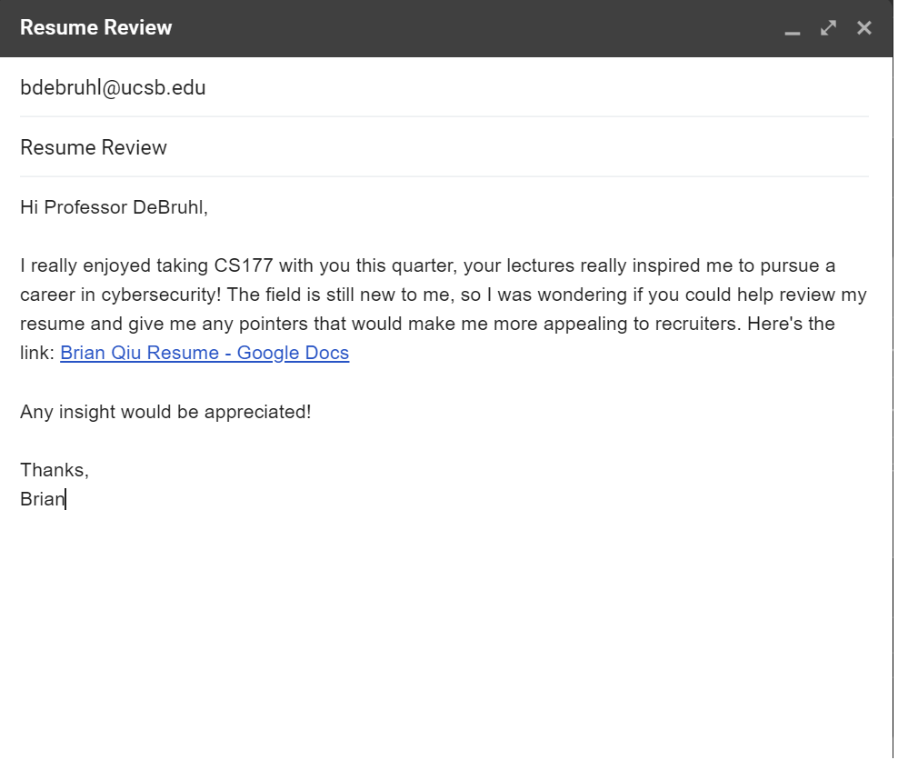
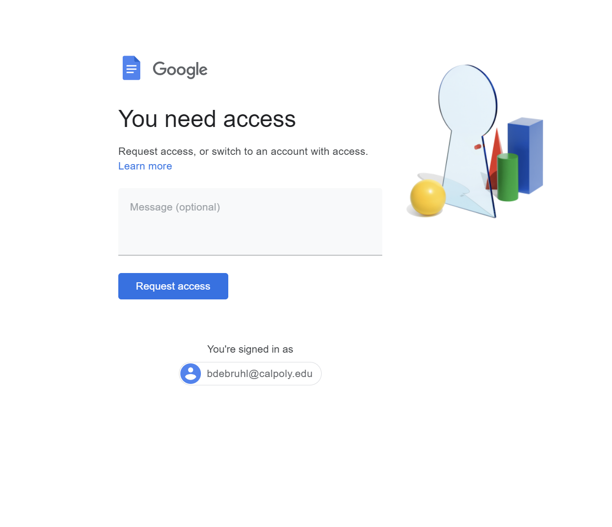
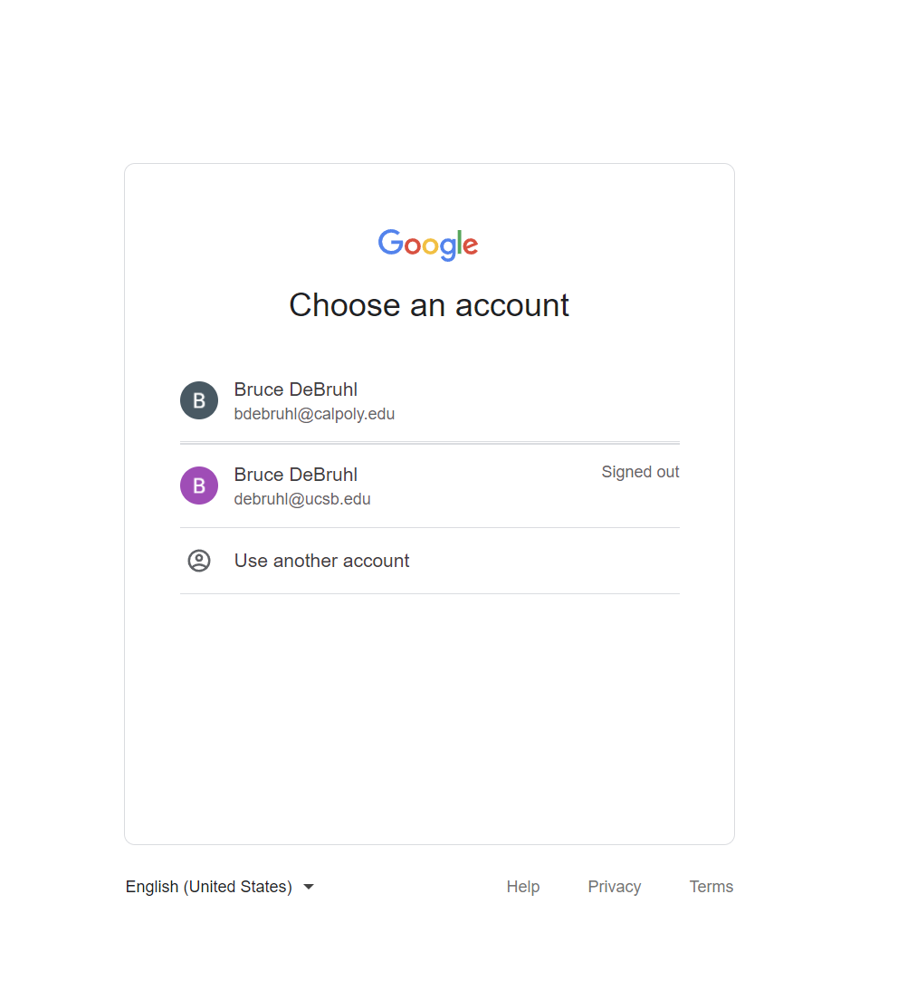
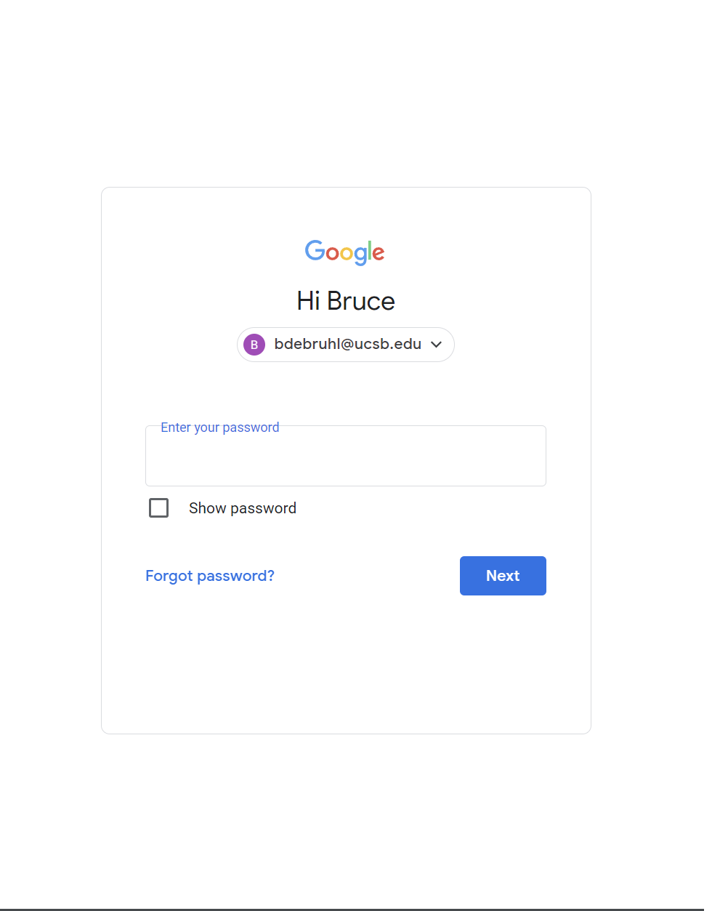
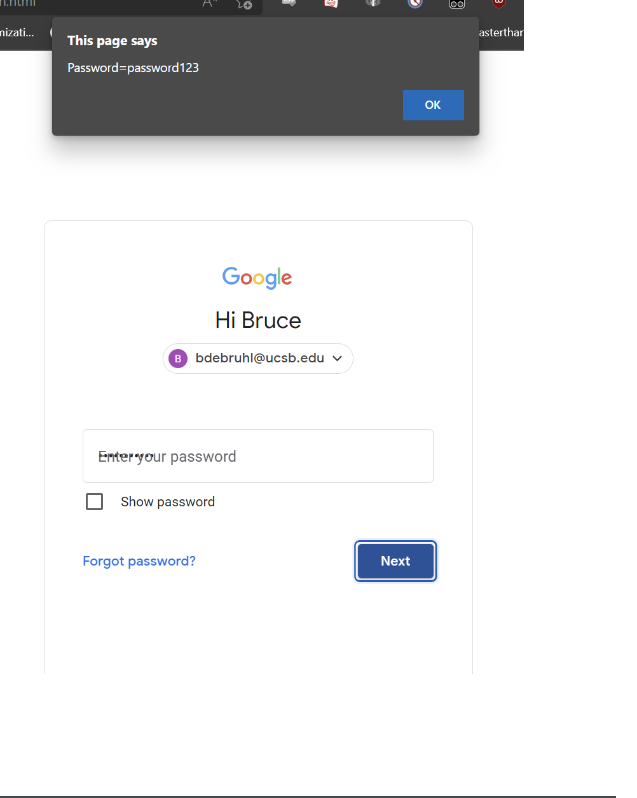

# CS177 Assignment 1 Phishing

- Authors: Edward Thai, Brian Qiu

## Flow

Prof DeBruhl opens up an email from one of his former students asking for help on his resume. 

Being the nice guy that he is, he decides to look at his resume to give some pointers. Unfortunately, he doesn't seem to have access to the doc. However, since the email was sent from a UCSB email and Prof DeBruhl is currently logged into his Cal Poly email, he thinks that switching accounts might give him access to the doc.

After clicking on his email to switch accounts, he notices that he's logged out of his UCSB email. Since UCSB periodically logs out users automatically, this doesn't ring any alarms. He selects his account to login.

Thinking nothing of it, Prof DeBruhl enters his password into the field and tries to login. 

However, when he presses the next button, the data is sent to an adversary's servers!

